# Eulerian Hades
A Learning Platform and Problem Solver for engineering students to intuitively learn concepts and topics from Math and Computer Science. 

  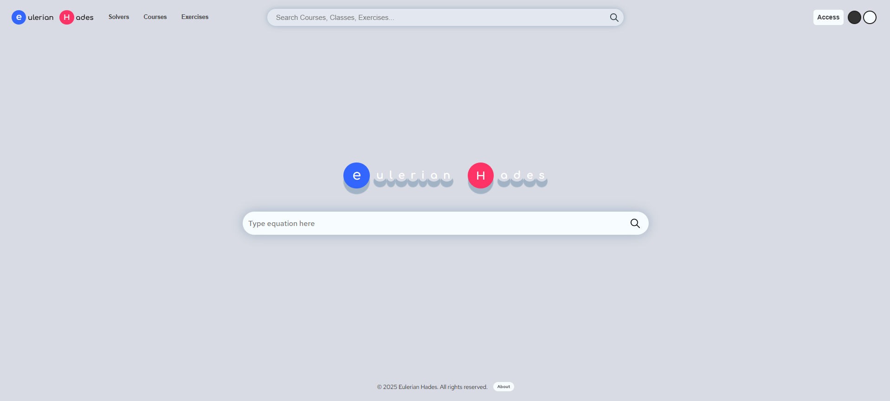 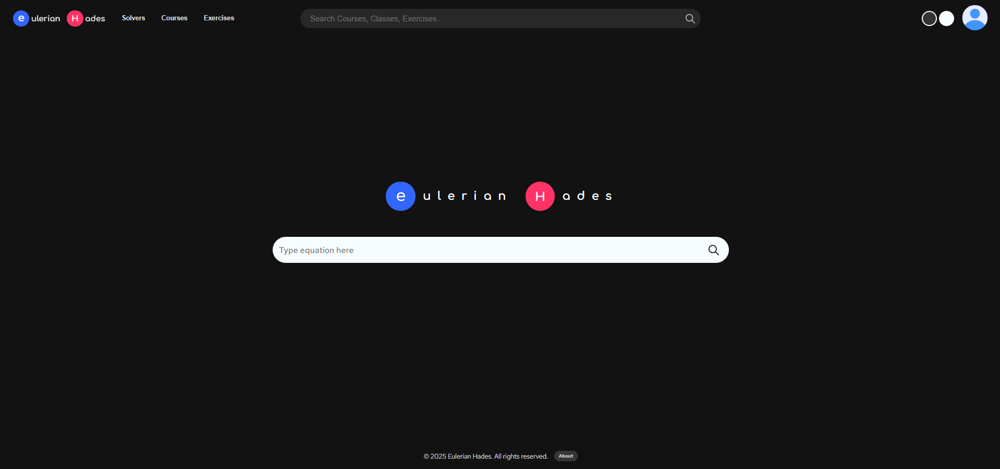

### Frontend:
 
 
 
 
 
 

### Backend:
 
 
 

### Databases
 
<!--   -->

### Infrastructure & DevOps
 
 

## 📊 Diagrams

### Clases Diagram

  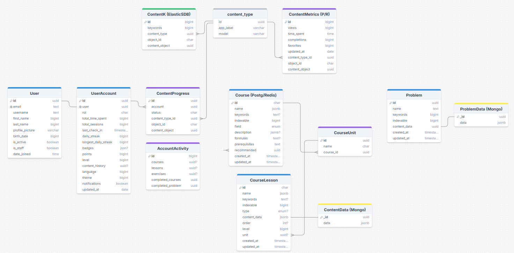 

### User Cases

  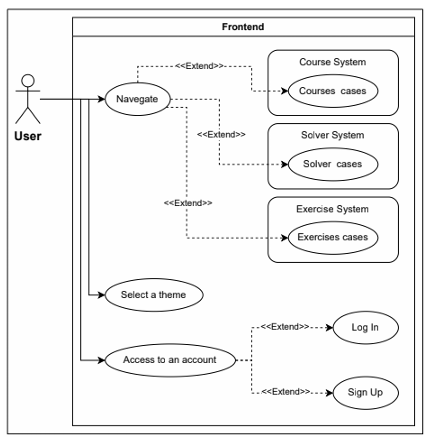
  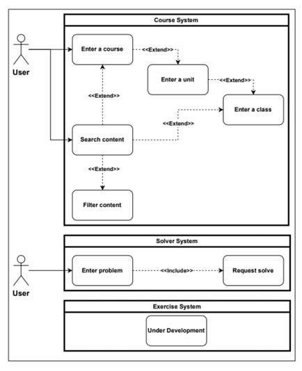

### Paths Graph

  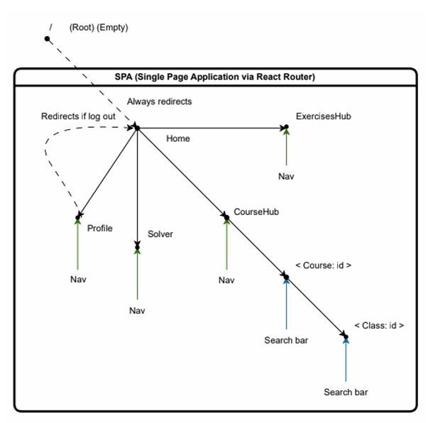 

## Views

  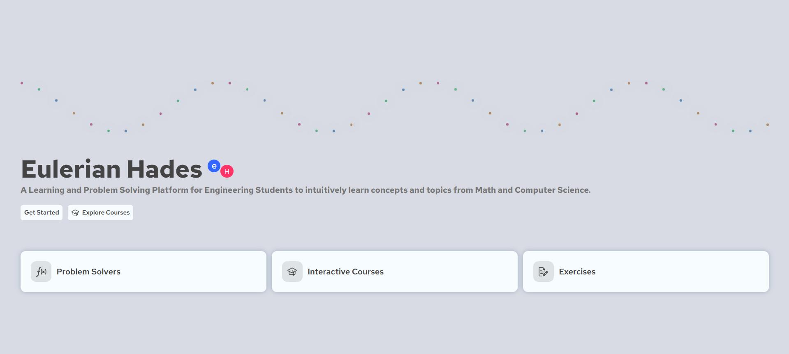 
  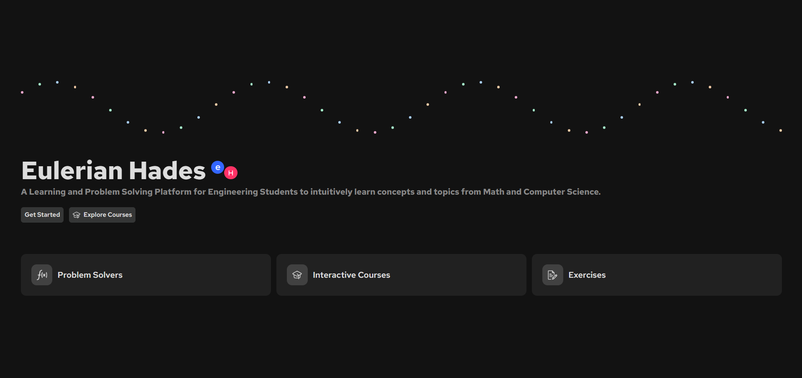

   
  

  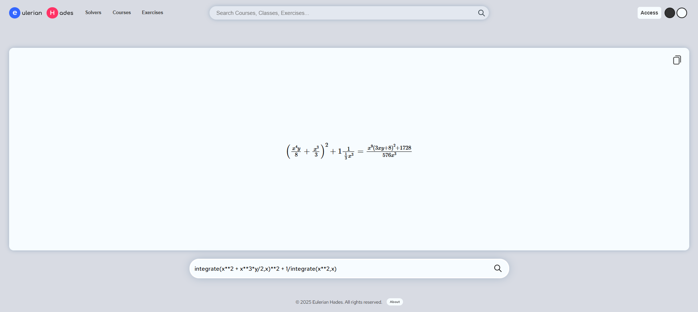 
  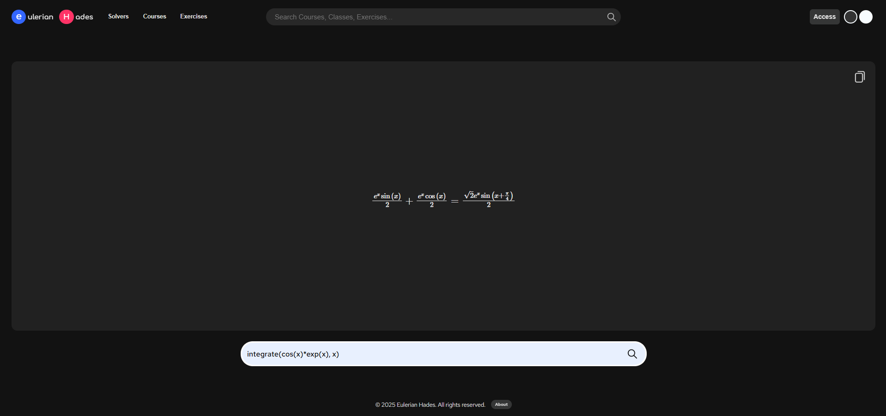

  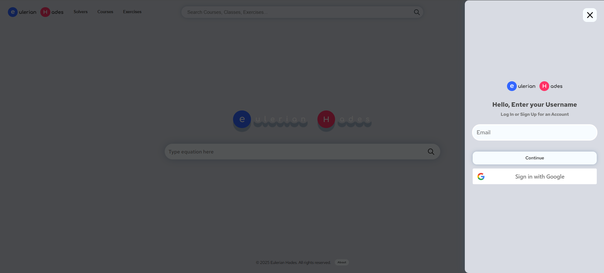 
  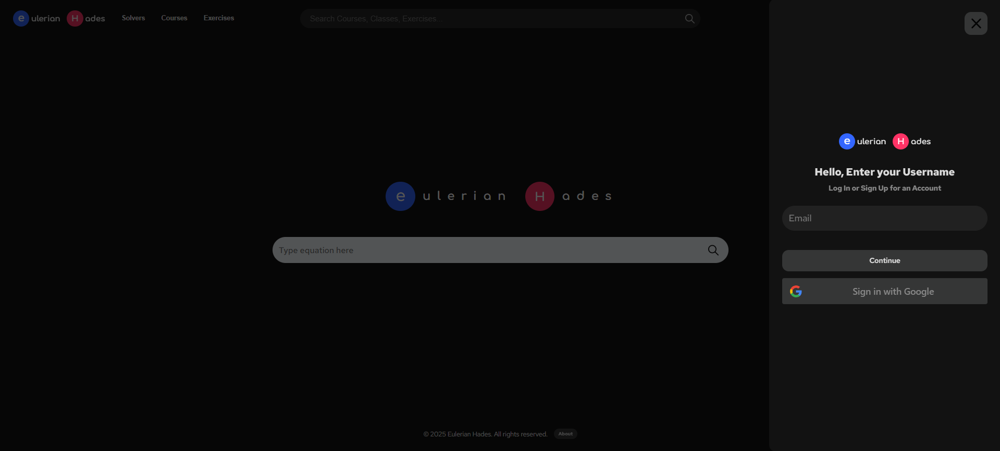

  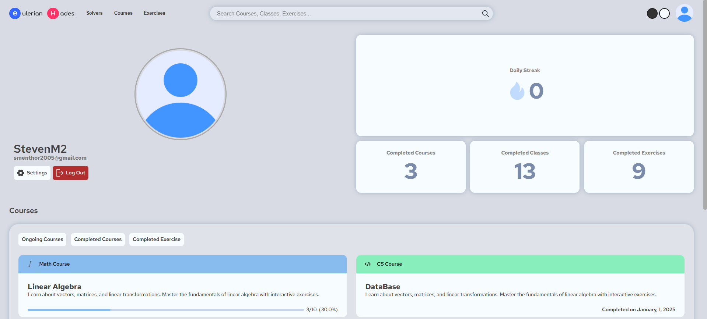 
  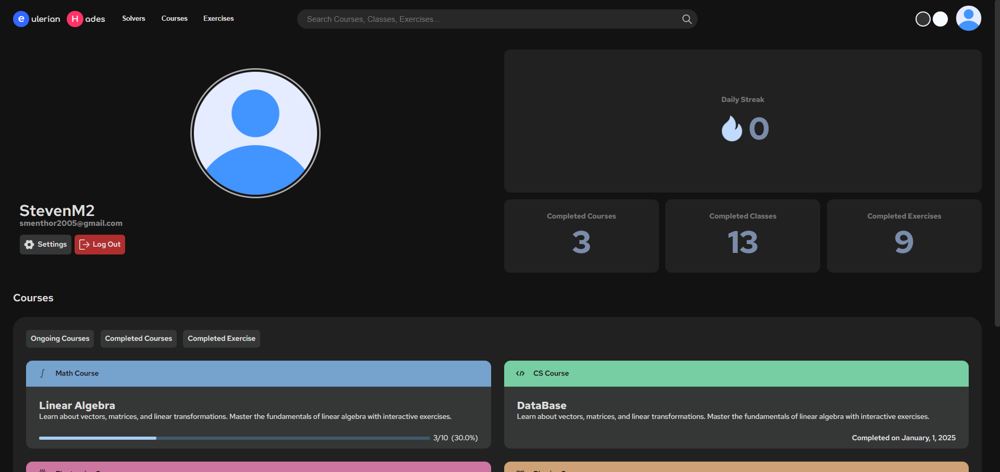

  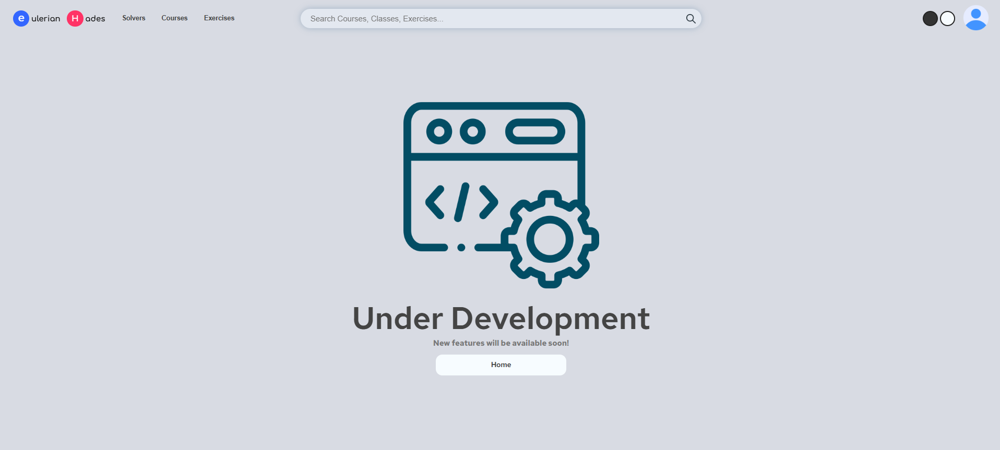 
  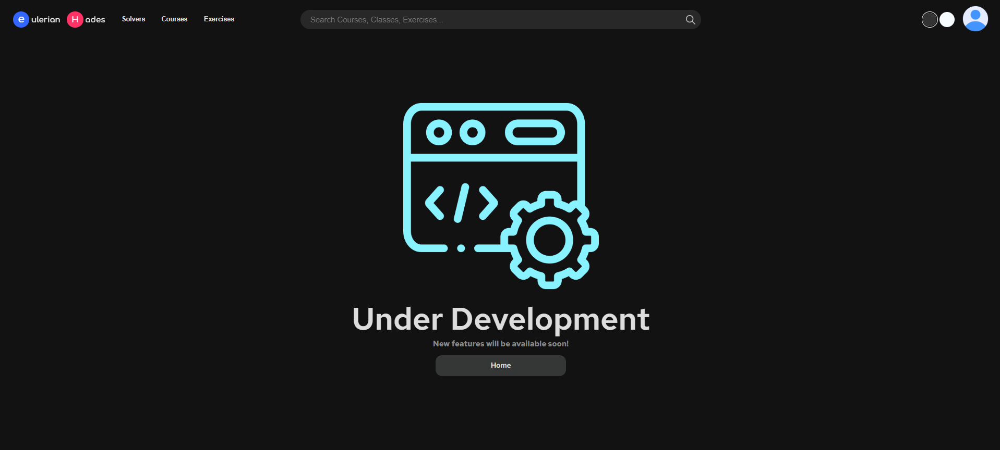

